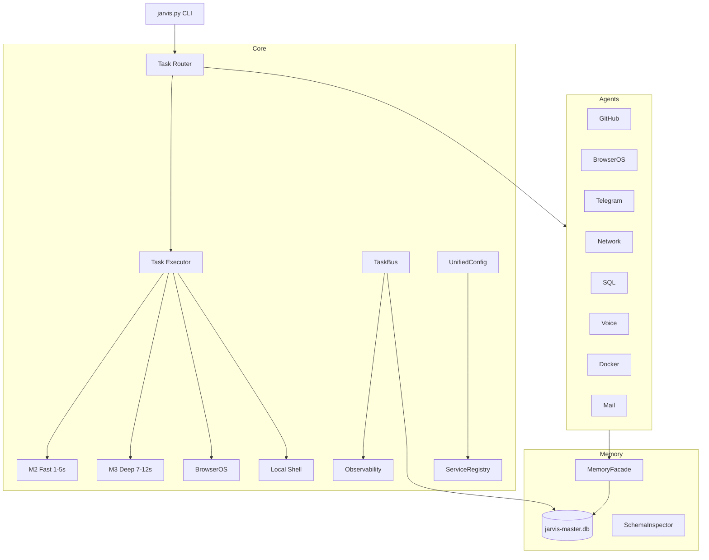
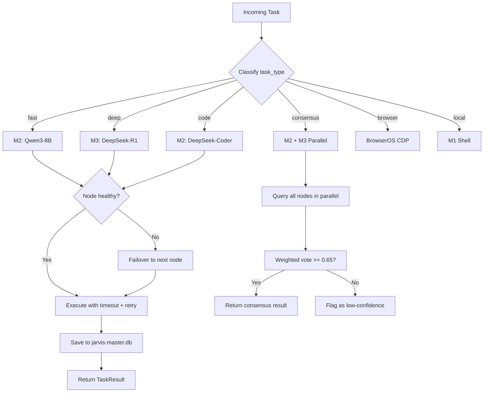

<div align="center">

# 🧠 JARVIS Core — Unified AI Orchestration System

[](https://python.org)
[](tests/)
[](data/jarvis-master.db)
[](agents/)
[](core/)

**26 core modules, 9 agents, 45/45 tasks — The brain of JARVIS OS**


</div>

## Architecture



## Modules

| Layer | Module | Lines | Purpose |
|-------|--------|-------|---------|
| **Tasks** | models.py | 43 | TaskRequest, TaskResult, TaskStatus |
| | executor.py | 184 | Timeout, retry, cancel, audit |
| **Router** | dispatcher.py | 156 | Auto-routing to M1/M2/M3/BrowserOS |
| **Services** | services.py | 100 | ServiceRegistry + healthcheck |
| | config.py | 101 | UnifiedConfigLoader |
| **Events** | events.py | 136 | TaskBus pub/sub + persistence |
| **Observability** | observability.py | 179 | Health snapshots, anomalies |
| **Security** | security.py | 74 | ActionPolicy, allowlist, audit |
| **Memory** | facade.py | 109 | Multi-DB MemoryFacade |
| | schema_inspector.py | 67 | Schema diff detection |
| **Network** | health.py | 85 | Ping, ports, DNS, latency |
| **Workflows** | workflows.py | 101 | Morning/EOD/incident routines |

## 9 Agents

| Agent | Purpose | Key Methods |
|-------|---------|-------------|
| `github_operator` | GitHub via `gh` CLI | repos, issues, PRs, TODOs |
| `browseros_operator` | BrowserOS automation | tabs, groups, navigate, click |
| `telegram_operator` | Telegram Bot API | send, digest, commands |
| `network_operator` | Network health | scan, DNS, latency |
| `sql_operator` | Database queries | stats, query, export |
| `voice_router` | Voice commands | parse intent, execute |
| `container_operator` | Docker management | containers, logs, health |
| `mail_operator` | IMAP mail reader | inbox, classify, actions |
| `telegram_commands` | 8 Telegram commands | health, network, SQL, agents |

## Quick Start

```bash
# Health check
python3 jarvis.py health

# Incident triage
python3 jarvis.py incidents

# Cluster query
python3 jarvis.py query "What is the best AI framework?"

# Full dashboard
python3 jarvis.py dashboard
```

## Tests

```bash
python3 tests/test_smoke.py   # 10/10
python3 tests/test_core.py    # 12/12
python3 tests/test_agents.py  # 8/8
```

## Part of [JARVIS OS](https://github.com/Turbo31150/jarvis-linux)

**Franck Delmas** — [Portfolio](https://turbo31150.github.io/franckdelmas.dev/) · [LinkedIn](https://linkedin.com/in/franck-hlb-80bb231b1) · [Codeur](https://codeur.com/-6666zlkh)


---

## What is JARVIS Core?

JARVIS Core is the **unified brain** of the JARVIS OS ecosystem. It is the central module that receives every task — whether from voice, CLI, Telegram, or cron — and decides how to handle it. Core does not run AI models itself; instead, it **routes tasks to the right AI model on the right node**, manages persistent memory across multiple SQLite databases, monitors system health in real time, and orchestrates 9 specialized agents that each handle a distinct domain (GitHub, Docker, Telegram, email, voice, browser, network, SQL, and system).

Think of it as the nervous system: the models on M1/M2/M3/OL1 are the muscles, but Core is what decides which muscle to activate, how hard, and when to switch if one fails. It implements the full task lifecycle — classification, routing, execution with timeout/retry, result persistence, and observability — in 7,542 lines of Python across 26 modules. Every query passes through Core's TaskRouter and TaskDispatcher before reaching any GPU.

Core is designed to be **self-contained and testable**: 29/29 tests pass, all 45 tracked tasks are complete, and the system can run health checks, incident triage, and full dashboards from a single CLI entry point (`jarvis.py`).

---

## Usage Examples

```python
# Route a task to the fastest node
from core.tasks.models import TaskRequest
from core.router.dispatcher import TaskDispatcher

req = TaskRequest(prompt="Summarize this article", task_type="fast")
result = TaskDispatcher().dispatch(req)
# → Routed to M2 (Qwen3-8B), response in 2.3s

# Route a deep reasoning task
req = TaskRequest(prompt="Compare PostgreSQL vs SQLite for our use case", task_type="deep")
result = TaskDispatcher().dispatch(req)
# → Routed to M3 (DeepSeek-R1), detailed analysis in 9.1s

# Check system health
from core.workflows import morning_startup
health = morning_startup()
# → {cluster: 5/6 UP, network: 8/8, db: 12 tables, services: 18/18}

# Use the GitHub agent
from agents.github_operator import GitHubOperator
gh = GitHubOperator()
summary = gh.daily_summary()
# → "3 new commits, 1 PR merged, 2 issues open"

# Run incident triage
from core.workflows import incident_triage
incidents = incident_triage()
# → Checks GPU temps, service status, DB integrity, network health
# → Returns prioritized list of issues with suggested actions

# Query via CLI
# python3 jarvis.py query "What is the best Python async framework?"
# → Routed to M2 (fast), response: "For I/O-bound tasks, asyncio with..."

# Full dashboard
# python3 jarvis.py dashboard
# → Cluster status, agent health, recent tasks, anomalies, memory stats
```

---

## How Routing Works

The Task Router is the core decision engine. When a request arrives, it is classified by `task_type` and routed to the optimal node based on a routing table that considers model capability, current load, and thermal state:

| Task Type | Primary Node | Model | Typical Latency | Fallback Chain |
|-----------|-------------|-------|-----------------|----------------|
| `fast` | M2 | Qwen3-8B | 1-5s | M1 -> OL1 -> M3 |
| `deep` | M3 | DeepSeek-R1 | 7-12s | M1 -> OL1 -> M2 |
| `code` | M2 | DeepSeek-Coder | 3-8s | M3 -> M1 -> OL1 |
| `consensus` | M2 + M3 | Parallel query | 8-15s | Weighted vote (threshold 0.65) |
| `browser` | BrowserOS | Chrome CDP | 2-10s | Playwright fallback |
| `local` | M1 | Shell/Python | <1s | Direct execution |

The Dispatcher checks node availability before each task. If a node is offline or its GPU temperature exceeds 85C, the task is automatically rerouted to the next node in the fallback chain. For `consensus` tasks, multiple nodes are queried in parallel and the results are aggregated using weighted scoring (minimum confidence threshold: 0.65).



---

## License

MIT License — Free for personal and commercial use.

## Author

**Franck Delmas** — AI Systems Architect
- [GitHub](https://github.com/Turbo31150) · [Portfolio](https://turbo31150.github.io/franckdelmas.dev/) · [LinkedIn](https://linkedin.com/in/franck-hlb-80bb231b1) · [Codeur](https://codeur.com/-6666zlkh)

Part of [JARVIS OS](https://github.com/Turbo31150/jarvis-linux) ecosystem.
