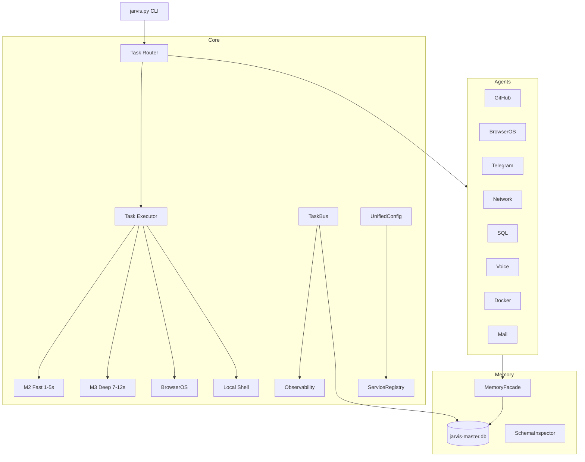

<div align="center">

# 🧠 JARVIS Core — Unified AI Orchestration System

[](https://python.org)
[](tests/)
[](data/jarvis-master.db)
[](agents/)
[](core/)

**26 core modules, 9 agents, 45/45 tasks — The brain of JARVIS OS**


</div>

## Architecture



## Modules

| Layer | Module | Lines | Purpose |
|-------|--------|-------|---------|
| **Tasks** | models.py | 43 | TaskRequest, TaskResult, TaskStatus |
| | executor.py | 184 | Timeout, retry, cancel, audit |
| **Router** | dispatcher.py | 156 | Auto-routing to M1/M2/M3/BrowserOS |
| **Services** | services.py | 100 | ServiceRegistry + healthcheck |
| | config.py | 101 | UnifiedConfigLoader |
| **Events** | events.py | 136 | TaskBus pub/sub + persistence |
| **Observability** | observability.py | 179 | Health snapshots, anomalies |
| **Security** | security.py | 74 | ActionPolicy, allowlist, audit |
| **Memory** | facade.py | 109 | Multi-DB MemoryFacade |
| | schema_inspector.py | 67 | Schema diff detection |
| **Network** | health.py | 85 | Ping, ports, DNS, latency |
| **Workflows** | workflows.py | 101 | Morning/EOD/incident routines |

## 9 Agents

| Agent | Purpose | Key Methods |
|-------|---------|-------------|
| `github_operator` | GitHub via `gh` CLI | repos, issues, PRs, TODOs |
| `browseros_operator` | BrowserOS automation | tabs, groups, navigate, click |
| `telegram_operator` | Telegram Bot API | send, digest, commands |
| `network_operator` | Network health | scan, DNS, latency |
| `sql_operator` | Database queries | stats, query, export |
| `voice_router` | Voice commands | parse intent, execute |
| `container_operator` | Docker management | containers, logs, health |
| `mail_operator` | IMAP mail reader | inbox, classify, actions |
| `telegram_commands` | 8 Telegram commands | health, network, SQL, agents |

## Quick Start

```bash
# Health check
python3 jarvis.py health

# Incident triage
python3 jarvis.py incidents

# Cluster query
python3 jarvis.py query "What is the best AI framework?"

# Full dashboard
python3 jarvis.py dashboard
```

## Tests

```bash
python3 tests/test_smoke.py   # 10/10
python3 tests/test_core.py    # 12/12
python3 tests/test_agents.py  # 8/8
```

## Part of [JARVIS OS](https://github.com/Turbo31150/jarvis-linux)

**Franck Delmas** — [Portfolio](https://turbo31150.github.io/franckdelmas.dev/) · [LinkedIn](https://linkedin.com/in/franck-hlb-80bb231b1) · [Codeur](https://codeur.com/-6666zlkh)


---

## License

MIT License — Free for personal and commercial use.

## Author

**Franck Delmas** — AI Systems Architect
- [GitHub](https://github.com/Turbo31150) · [Portfolio](https://turbo31150.github.io/franckdelmas.dev/) · [LinkedIn](https://linkedin.com/in/franck-hlb-80bb231b1) · [Codeur](https://codeur.com/-6666zlkh)

Part of [JARVIS OS](https://github.com/Turbo31150/jarvis-linux) ecosystem.
