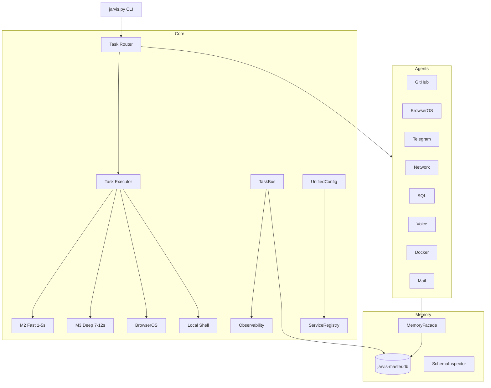
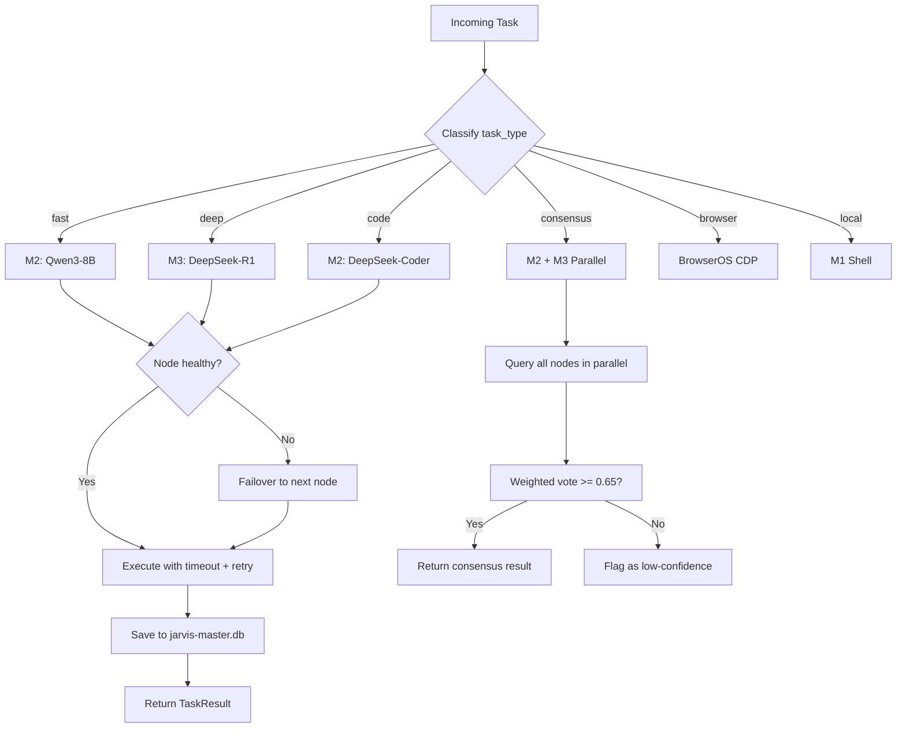

<div align="center">

# 🧠 JARVIS Core — Unified AI Orchestration System

[](https://python.org)
[](tests/)
[](data/jarvis-master.db)
[](agents/)
[](core/)

**26 core modules, 9 agents, 45/45 tasks — The brain of JARVIS OS**


</div>

## Architecture



## Modules

| Layer | Module | Lines | Purpose |
|-------|--------|-------|---------|
| **Tasks** | models.py | 43 | TaskRequest, TaskResult, TaskStatus |
| | executor.py | 184 | Timeout, retry, cancel, audit |
| **Router** | dispatcher.py | 156 | Auto-routing to M1/M2/M3/BrowserOS |
| **Services** | services.py | 100 | ServiceRegistry + healthcheck |
| | config.py | 101 | UnifiedConfigLoader |
| **Events** | events.py | 136 | TaskBus pub/sub + persistence |
| **Observability** | observability.py | 179 | Health snapshots, anomalies |
| **Security** | security.py | 74 | ActionPolicy, allowlist, audit |
| **Memory** | facade.py | 109 | Multi-DB MemoryFacade |
| | schema_inspector.py | 67 | Schema diff detection |
| **Network** | health.py | 85 | Ping, ports, DNS, latency |
| **Workflows** | workflows.py | 101 | Morning/EOD/incident routines |

## 9 Agents

| Agent | Purpose | Key Methods |
|-------|---------|-------------|
| `github_operator` | GitHub via `gh` CLI | repos, issues, PRs, TODOs |
| `browseros_operator` | BrowserOS automation | tabs, groups, navigate, click |
| `telegram_operator` | Telegram Bot API | send, digest, commands |
| `network_operator` | Network health | scan, DNS, latency |
| `sql_operator` | Database queries | stats, query, export |
| `voice_router` | Voice commands | parse intent, execute |
| `container_operator` | Docker management | containers, logs, health |
| `mail_operator` | IMAP mail reader | inbox, classify, actions |
| `telegram_commands` | 8 Telegram commands | health, network, SQL, agents |

## Quick Start

```bash
# Health check
python3 jarvis.py health

# Incident triage
python3 jarvis.py incidents

# Cluster query
python3 jarvis.py query "What is the best AI framework?"

# Full dashboard
python3 jarvis.py dashboard
```

## Tests

```bash
python3 tests/test_smoke.py   # 10/10
python3 tests/test_core.py    # 12/12
python3 tests/test_agents.py  # 8/8
```

## Part of [JARVIS OS](https://github.com/Turbo31150/jarvis-linux)

**Franck Delmas** — [Portfolio](https://turbo31150.github.io/franckdelmas.dev/) · [LinkedIn](https://linkedin.com/in/franck-hlb-80bb231b1) · [Codeur](https://codeur.com/-6666zlkh)


---

## What is JARVIS Core?

JARVIS Core is the **unified brain** of the JARVIS OS ecosystem. It is the central module that receives every task — whether from voice, CLI, Telegram, or cron — and decides how to handle it. Core does not run AI models itself; instead, it **routes tasks to the right AI model on the right node**, manages persistent memory across multiple SQLite databases, monitors system health in real time, and orchestrates 9 specialized agents that each handle a distinct domain (GitHub, Docker, Telegram, email, voice, browser, network, SQL, and system).

Think of it as the nervous system: the models on M1/M2/M3/OL1 are the muscles, but Core is what decides which muscle to activate, how hard, and when to switch if one fails. It implements the full task lifecycle — classification, routing, execution with timeout/retry, result persistence, and observability — in 7,542 lines of Python across 26 modules. Every query passes through Core's TaskRouter and TaskDispatcher before reaching any GPU.

Core is designed to be **self-contained and testable**: 29/29 tests pass, all 45 tracked tasks are complete, and the system can run health checks, incident triage, and full dashboards from a single CLI entry point (`jarvis.py`).

---

## Usage Examples

```python
# Route a task to the fastest node
from core.tasks.models import TaskRequest
from core.router.dispatcher import TaskDispatcher

req = TaskRequest(prompt="Summarize this article", task_type="fast")
result = TaskDispatcher().dispatch(req)
# → Routed to M2 (Qwen3-8B), response in 2.3s

# Route a deep reasoning task
req = TaskRequest(prompt="Compare PostgreSQL vs SQLite for our use case", task_type="deep")
result = TaskDispatcher().dispatch(req)
# → Routed to M3 (DeepSeek-R1), detailed analysis in 9.1s

# Check system health
from core.workflows import morning_startup
health = morning_startup()
# → {cluster: 5/6 UP, network: 8/8, db: 12 tables, services: 18/18}

# Use the GitHub agent
from agents.github_operator import GitHubOperator
gh = GitHubOperator()
summary = gh.daily_summary()
# → "3 new commits, 1 PR merged, 2 issues open"

# Run incident triage
from core.workflows import incident_triage
incidents = incident_triage()
# → Checks GPU temps, service status, DB integrity, network health
# → Returns prioritized list of issues with suggested actions

# Query via CLI
# python3 jarvis.py query "What is the best Python async framework?"
# → Routed to M2 (fast), response: "For I/O-bound tasks, asyncio with..."

# Full dashboard
# python3 jarvis.py dashboard
# → Cluster status, agent health, recent tasks, anomalies, memory stats
```

---

## How Routing Works

The Task Router is the core decision engine. When a request arrives, it is classified by `task_type` and routed to the optimal node based on a routing table that considers model capability, current load, and thermal state:

| Task Type | Primary Node | Model | Typical Latency | Fallback Chain |
|-----------|-------------|-------|-----------------|----------------|
| `fast` | M2 | Qwen3-8B | 1-5s | M1 -> OL1 -> M3 |
| `deep` | M3 | DeepSeek-R1 | 7-12s | M1 -> OL1 -> M2 |
| `code` | M2 | DeepSeek-Coder | 3-8s | M3 -> M1 -> OL1 |
| `consensus` | M2 + M3 | Parallel query | 8-15s | Weighted vote (threshold 0.65) |
| `browser` | BrowserOS | Chrome CDP | 2-10s | Playwright fallback |
| `local` | M1 | Shell/Python | <1s | Direct execution |

The Dispatcher checks node availability before each task. If a node is offline or its GPU temperature exceeds 85C, the task is automatically rerouted to the next node in the fallback chain. For `consensus` tasks, multiple nodes are queried in parallel and the results are aggregated using weighted scoring (minimum confidence threshold: 0.65).



---

## License

MIT License — Free for personal and commercial use.

## Author

**Franck Delmas** — AI Systems Architect
- [GitHub](https://github.com/Turbo31150) · [Portfolio](https://turbo31150.github.io/franckdelmas.dev/) · [LinkedIn](https://linkedin.com/in/franck-hlb-80bb231b1) · [Codeur](https://codeur.com/-6666zlkh)

Part of [JARVIS OS](https://github.com/Turbo31150/jarvis-linux) ecosystem.


---

## Development Guide

### Adding a New Agent

Agents are modular operators that handle a specific domain. To create one:

1. Create the agent file in `agents/`:

```python
# agents/my_operator.py
from core.base_agent import BaseAgent

class MyOperator(BaseAgent):
    """Operator for [domain] tasks."""

    name = "my_operator"
    description = "Handles [domain] operations"

    async def health(self) -> dict:
        """Return health status for this agent."""
        return {"status": "ok", "details": "All systems nominal"}

    async def execute(self, task: str, params: dict = None) -> dict:
        """Execute a task within this agent's domain."""
        if task == "my_action":
            return await self._do_my_action(params)
        raise ValueError(f"Unknown task: {task}")

    async def _do_my_action(self, params: dict) -> dict:
        """Internal implementation."""
        # Your logic here
        return {"result": "success", "data": params}
```

2. Register the agent in `config/agents.yaml`:
```yaml
agents:
  - name: my_operator
    module: agents.my_operator
    class: MyOperator
    enabled: true
    health_check_interval: 60  # seconds
```

3. Add routing rules in `core/router/dispatcher.py`:
```python
ROUTING_TABLE["my_domain"] = {
    "agent": "my_operator",
    "primary_node": "M1",
    "fallback": ["M2", "OL1"],
}
```

4. Write tests in `tests/test_my_operator.py`:
```python
import pytest
from agents.my_operator import MyOperator

@pytest.mark.asyncio
async def test_health():
    agent = MyOperator()
    result = await agent.health()
    assert result["status"] == "ok"

@pytest.mark.asyncio
async def test_my_action():
    agent = MyOperator()
    result = await agent.execute("my_action", {"key": "value"})
    assert result["result"] == "success"
```

### Adding a New Route

Routes map incoming task types to agents and nodes. To add a new route:

1. Define the route in the dispatcher's routing table:
```python
# core/router/dispatcher.py
ROUTING_TABLE["my_task_type"] = {
    "agent": "my_operator",           # Which agent handles this
    "primary_node": "M2",             # Preferred execution node
    "fallback": ["M3", "M1", "OL1"], # Failover chain
    "timeout": 30,                     # Seconds before timeout
    "retries": 2,                      # Number of retry attempts
    "thermal_limit": 85,              # Max GPU temp (Celsius)
}
```

2. The task executor automatically picks up the route. Test it:
```bash
python3 jarvis.py query --type my_task_type "Test prompt"
```

### Adding a Test

Tests are organized by scope in the `tests/` directory:

| File | Scope | What It Tests |
|------|-------|--------------|
| `test_smoke.py` | Smoke (10) | Imports, basic instantiation, CLI entry point |
| `test_core.py` | Unit (12) | Router, executor, events, config, security |
| `test_agents.py` | Integration (8) | Each agent's health check and basic operations |

To add a new test:
```python
# tests/test_core.py (append to existing file)

def test_my_new_feature():
    """Test description explaining what this validates."""
    from core.my_module import my_function
    result = my_function(input_data)
    assert result == expected_output
    assert "key" in result
```

Run all tests:
```bash
python3 -m pytest tests/ -v          # verbose output
python3 -m pytest tests/ -x          # stop on first failure
python3 -m pytest tests/ -k "smoke"  # run only smoke tests
```

---

## Configuration Reference

### Environment Variables

| Variable | Default | Description |
|----------|---------|-------------|
| `JARVIS_HOME` | `~/jarvis` | Root directory for all JARVIS data and config |
| `JARVIS_DB` | `data/jarvis-master.db` | Path to the main SQLite database |
| `JARVIS_LOG_LEVEL` | `INFO` | Logging level: DEBUG, INFO, WARNING, ERROR |
| `JARVIS_LOG_FILE` | `logs/jarvis.log` | Log file path (rotated daily) |
| `M1_ENDPOINT` | `http://127.0.0.1:1234` | M1 LMStudio API endpoint |
| `M2_ENDPOINT` | `http://192.168.1.26:1234` | M2 LMStudio API endpoint |
| `M3_ENDPOINT` | `http://192.168.1.113:1234` | M3 LMStudio API endpoint |
| `OL1_ENDPOINT` | `http://127.0.0.1:11434` | OL1 Ollama API endpoint |
| `BROWSEROS_URL` | `http://localhost:9222` | BrowserOS CDP endpoint |
| `TELEGRAM_BOT_TOKEN` | *(none)* | Telegram bot API token |
| `TELEGRAM_CHAT_ID` | *(none)* | Default Telegram chat ID for notifications |
| `MCP_PORT` | `8901` | Port for the MCP toolkit server |
| `MCP_BIND` | `127.0.0.1` | Bind address for MCP server |
| `GPU_THERMAL_LIMIT` | `85` | Maximum GPU temperature before failover (Celsius) |
| `TASK_TIMEOUT` | `30` | Default task timeout in seconds |
| `TASK_RETRIES` | `2` | Default retry count for failed tasks |
| `HEALTH_CHECK_INTERVAL` | `60` | Seconds between health check cycles |
| `MEXC_API_KEY` | *(none)* | MEXC exchange API key for trading |
| `MEXC_API_SECRET` | *(none)* | MEXC exchange API secret |

### Configuration Files

| File | Purpose |
|------|---------|
| `config/agents.yaml` | Agent registration and settings |
| `config/routes.yaml` | Task routing rules and fallback chains |
| `config/nodes.yaml` | Cluster node definitions and endpoints |
| `config/models.yaml` | AI model catalog with VRAM requirements |
| `config/voice.yaml` | Voice pipeline settings (wake word, language) |
| `config/trading.yaml` | Trading parameters (pairs, limits, strategies) |

---

## Deployment Guide

### Systemd Service

Create a systemd unit file for automatic startup and restart:

```ini
# /etc/systemd/system/jarvis-core.service
[Unit]
Description=JARVIS Core Orchestration Service
After=network.target
Wants=network-online.target

[Service]
Type=simple
User=turbo
Group=turbo
WorkingDirectory=/home/turbo/IA/Core/jarvis-core
ExecStart=/usr/bin/python3 jarvis.py serve
Restart=always
RestartSec=10
Environment=JARVIS_HOME=/home/turbo/jarvis
Environment=JARVIS_LOG_LEVEL=INFO
Environment=GPU_THERMAL_LIMIT=85
StandardOutput=append:/var/log/jarvis/core.log
StandardError=append:/var/log/jarvis/core-error.log

[Install]
WantedBy=multi-user.target
```

Enable and start:
```bash
sudo systemctl daemon-reload
sudo systemctl enable jarvis-core
sudo systemctl start jarvis-core
sudo systemctl status jarvis-core
```

### Docker Container

```dockerfile
# Dockerfile
FROM python:3.12-slim

WORKDIR /app
COPY requirements.txt .
RUN pip install --no-cache-dir -r requirements.txt

COPY . .

EXPOSE 8901
ENV JARVIS_HOME=/data
ENV JARVIS_LOG_LEVEL=INFO

VOLUME /data

CMD ["python3", "jarvis.py", "serve"]
```

Build and run:
```bash
docker build -t jarvis-core .
docker run -d \
    --name jarvis-core \
    -p 8901:8901 \
    -v /home/turbo/jarvis/data:/data \
    -e M1_ENDPOINT=http://host.docker.internal:1234 \
    -e TELEGRAM_BOT_TOKEN=your_token \
    --restart unless-stopped \
    jarvis-core
```

### Docker Compose (with cluster)

```yaml
# docker-compose.yml
version: "3.8"
services:
  jarvis-core:
    build: .
    ports:
      - "8901:8901"
    volumes:
      - jarvis-data:/data
    environment:
      - JARVIS_HOME=/data
      - M1_ENDPOINT=http://host.docker.internal:1234
      - M3_ENDPOINT=http://192.168.1.113:1234
      - OL1_ENDPOINT=http://host.docker.internal:11434
    restart: unless-stopped
    healthcheck:
      test: ["CMD", "python3", "jarvis.py", "health"]
      interval: 60s
      timeout: 10s
      retries: 3

volumes:
  jarvis-data:
```

